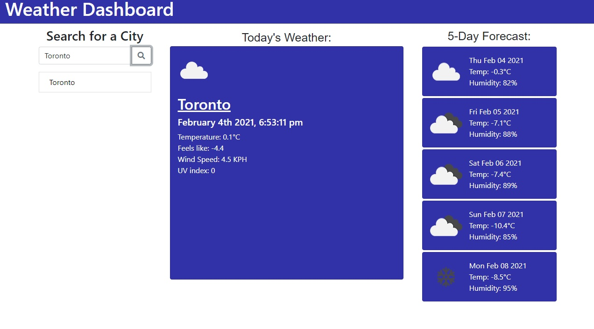
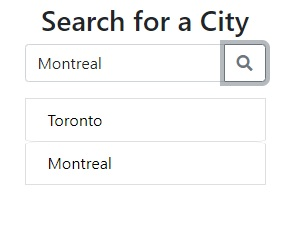

# Weather Dashboard

```Goals for this project:```

    1. Use an API to call current weather information
    2. Use an API to call five day forecast information
    3. Use an API to call a UV index for a searched location
    4. Have searched locations saved to local storage and save to a list
    5. The saved search results should be clickable and bring up the weather information

## Challenges

```The hardest part was getting the searched locations to show again once the webpage has been refreshed. Trial and error.```

## Screenshots

```The user will be shown a search bar asking them to input a location for weather information```


```After the user has searched a location the weather information will be displayed. Today's weather will appear in the middle along with the 5-day forecast on the right side```



```The searched city will appear in a saved list so when the page is refreshed the user can just click the city. The weather information will repopulate once clicked.```



# Created by Andrew Boyle
## [Weather Dashboard](https://andyb2.github.io/WeatherDashboard/)